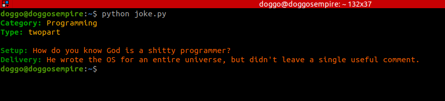
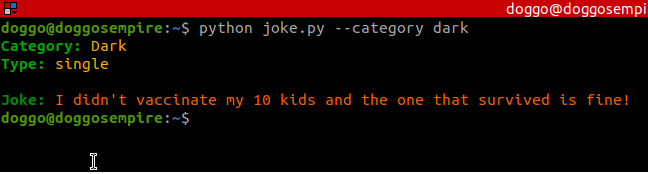
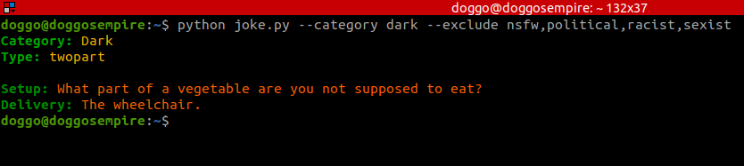

# Joke generator
*A simple script to get jokes*

## Usage
You can specify categories and types of jokes to avoid with `--category` and `--exclude`

**Note** that values are *cAsE uNsEnSiTivE* and *comma,separated*.
While `--category dark,pUn` is ok, `--category Dark Pun` isn't.

See the [Examples](#examples)

### Category (--category)
There are 4 categories:
- Programming
- Dark
- Pun
- Miscellaneous

There is `any` which chooses a random one.

If a non valid category is passed, an error will be written to stderr and the exit code will be `1`.

If you do not specify a category, `any` will be chosen.

### Types to exclude (--exclude)
There are 5 types of jokes:
- Nsfw
- Religious
- Political 
- Racist 
- Sexist

Passing `--exclude nsfw` will exclude nsfw jokes and the same applies to the other types. 

If you don't specify anything nothing will be excluded: you could get an nsfw joke.

##  Examples

*python joke.py*

*python joke.py --category dark*

*python joke.py --category dark --exclude nsfw,politics*

## Author
[Fossmentor](https://github.com/fossmentorOfficial)